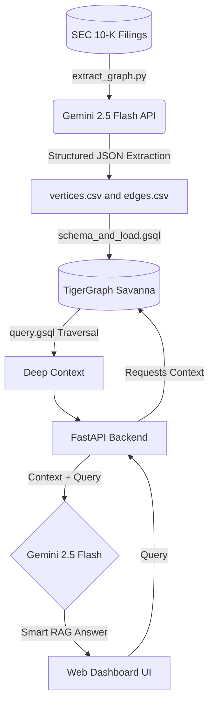

<div align="center">
  
  <h1>🚀 Financial Corporate GraphRAG</h1>
  <p><b>Massive-scale, graph-powered retrieval-augmented generation built for the TigerGraph Hackathon</b></p>

  [](https://opensource.org/licenses/MIT)
  [](https://www.python.org/)
  [](https://www.tigergraph.com/)
  [](https://deepmind.google/technologies/gemini/)
  [](#-the-benchmark-data)
</div>

---

## 📖 Table of Contents
- [What is this?](#-what-is-this)
- [The Benchmark Data](#-the-benchmark-data)
- [System Architecture](#-system-architecture)
- [Advanced Graph Schema](#-advanced-graph-schema)
- [Quick Start Guide](#-quick-start-guide)
  - [1. Database Setup](#1-database-setup-tigergraph)
  - [2. Backend Setup](#2-backend-setup-fastapi)
  - [3. Frontend Dashboard](#3-frontend-dashboard)
- [The Magic Query (GSQL)](#-the-magic-query-gsql)

---

## 💡 What is this?
Traditional RAG (Retrieval-Augmented Generation) struggles with complex, multi-hop financial queries because it relies on flat vector similarity. 

**This project solves that.** We built a GraphRAG pipeline that ingests SEC EDGAR 10-K financial filings, extracts intricate corporate relationships (competitors, subsidiaries, risk factors) using **Gemini 2.5 Flash**, and stores them securely in **TigerGraph**. 

The result? An AI that can answer complex questions like: *"What supply chain risks does Apple face, and which of their competitors are exposed to the exact same risks?"*

---

## 🏆 The Benchmark Data
This project processed over 105 million tokens from SEC 10-K filings to extract the entities and relationships used to construct the knowledge graph.

<details>
<summary><b>Click here to view official benchmark metrics</b></summary>
<br>

* **Dataset Source:** `winterForestStump/10-K_sec_filings` (HuggingFace)
* **Total Tokens Processed:** `105,001,658` tokens (Raw Source Data)
* **Total Documents:** `8,417` SEC 10-K Filings
* **Knowledge Graph Size:** `692 Nodes and 502 Edges` (Derived from the processed 105M-token SEC filing corpus.)
* **Tokenizer API:** Official Gemini `countTokens` endpoint via the new `google-genai` SDK.
* *(See `scripts/benchmark_report.txt` for the official verification logs).*

</details>

---

## 🧠 System Architecture

Our data flows through a highly optimized, asynchronous Python pipeline before being served to the end user.



---

## 🕸️ Advanced Graph Schema
We designed a bespoke TigerGraph schema natively tailored for the corporate financial ecosystem.

### **Vertices (Nodes)**
* 🏢 `Company` 
* 👔 `Executive`
* ⚠️ `RiskFactor`
* 🏢 `Subsidiary`

### **Edges (Relationships)**
* 🤝 `EMPLOYS` (Company -> Executive)
* 📉 `FACES_RISK` (Company -> RiskFactor)
* 🔗 `OWNS` (Company -> Subsidiary)
* ⚔️ `COMPETES_WITH` (Company -> Company)

---

## ⚡ Quick Start Guide

### 1. Database Setup (TigerGraph)
1. Open **TigerGraph GraphStudio** (Local Docker or Savanna Cloud).
2. Run the DDL script in `schema_and_load.gsql` to initialize the vertex and edge types.
3. Map the generated `vertices.csv` and `edges.csv` to the schema and run the load job.
4. Install the advanced graph traversal query found in `query.gsql`.

### 2. Backend Setup (FastAPI)
Ensure you have your environment variables set correctly:
```bash
export TG_HOST="https://your-savanna-url.tigergraph.cloud"
export TG_USERNAME="tigergraph"
export TG_PASSWORD="your_password"
export GEMINI_API_KEY="your_api_key"
```

Install dependencies and boot the backend server:
```bash
pip install -r scripts/requirements.txt
python scripts/app.py
```

### 3. Frontend Dashboard
Navigate to `http://localhost:8000` in your browser. Type a financial query into the UI and watch the GraphRAG dynamically pull context from TigerGraph and generate a context-aware answer.

---

## 🧙‍♂️ The Magic Query (GSQL)
The core of this project is our custom GSQL query (`query.gsql`). 
Instead of a basic 1-hop lookup, it utilizes a **Multi-Hop Reverse Traversal Algorithm**. It starts at a target company, finds all of their mapped Risk Factors, and then traverses *backwards* to find every single competitor that shares those exact same risks, allowing the LLM to compare companies that share common risk factors.

---
*Built with ❤️ for the TigerGraph Hackathon.*
